 

## About Me

<table>
<tr>
<td width="58%" valign="top">

I'm a developer from India, building toward a full-stack + AI specialization while studying at Amrapali University. I love creating web & mobile apps, exploring new technologies, and turning ideas into real products.

</td>
<td width="42%" valign="top">

</td>
</tr>
</table>

 

## Tech Stack

**🟡 Languages**
 

**💗 Full-Stack & Mobile**
 

**🔮 AI / ML**
 

**🌊 Database & Infra**
 

**DSA** — Striver's A2Z Sheet

 

## GitHub Stats

<table>
<tr>
<td width="55%" valign="top">

</td>
<td width="45%" valign="top">

</td>
</tr>
</table>

Live stats pulled from GitHub — no hand-typed numbers to go stale.

 

## Featured Projects

<table>
<tr>
<td width="33%" valign="top">

**🏪 Ruhanix Marketplace**

Wholesale marketplace for traders & buyers, built during my Ruhanix Solutions internship — website, admin dashboard, and an Android/iOS app.

</td>
<td width="33%" valign="top">

**🔐 RuhanixAuth**

Authentication flow app for the Ruhanix platform, built with Expo Router.

</td>
<td width="33%" valign="top">

**📦 More Projects**

IPL 2024 analytics, UPI fraud detection, a multi-agent AI system, and a couple of gesture-controlled games.

[View on GitHub →](https://github.com/13mayankjoshi13)

</td>
</tr>
</table>

 

## Achievements & Currently Learning

<table>
<tr>
<td width="50%" valign="top">

### 🏆 Achievements

| | |
|:--|:--|
| Google | Gemini Student Ambassador (selected) |
| Infosys Springboard | Internship |
| IIT Kharagpur — KDSH 2026 | Semifinalist |
| IIT Roorkee Hackathon 2026 | Finalist |
| ET AI Hackathon 2026 | Semifinalist |
| Eat Right Youth, Uttarakhand | Represented Amrapali University |

</td>
<td width="50%" valign="top">

### 📚 Currently Learning

- Deep learning & AI — RAG pipelines, LangChain / LangGraph, transformer internals
- Cloud & systems — AWS / GCP architecture
- Automation — GitHub Actions
- DSA — Striver's A2Z Sheet

</td>
</tr>
</table>

 

## Connect with Me

Let's build something amazing together.

Made with 💜 by Mayank Joshi

