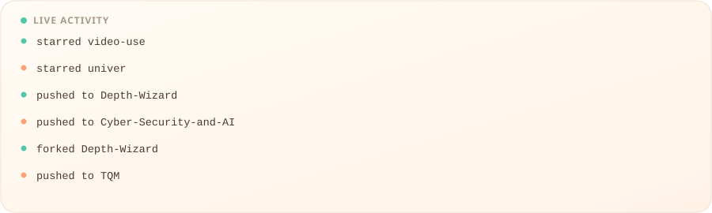
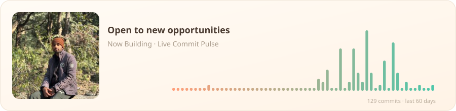

<h1 align="center">Mayank Joshi</h1>

Full-Stack Developer · AI/ML Enthusiast · Automation Builder

  
  
  
  

  

  

---

### 💼 Experience

| Role | Organization | Duration |
|---|---|---|
| Software Development Intern | Ruhanix Solutions | Jun 2026 – Aug 2026 |
| Google Gemini Student Ambassador | Google | Aug 2025 – Present |
| Intern | Infosys Springboard | Nov 2025 – Jan 2026 |
| Internshala Student Partner | Internshala | Jun 2025 – Aug 2025 |
| Internship Trainee | YBI Foundation | Feb 2025 – Mar 2025 |

---

### 🚀 Projects

| Project | Description |
|---|---|
| [Ruhanix Bus Booking](https://github.com/13mayankjoshi13) | Bus booking platform — website, Android/iOS app (Expo/React Native), and admin dashboard |
| [Assistive Glove Device](https://github.com/13mayankjoshi13/Assistive_Glove_Device) | Hardware-based assistive device with sensor integration |
| [Gesture-Controlled Fighting Game](https://github.com/13mayankjoshi13/advanced_gesture_fighting_game) | Real-time gesture-controlled game using computer vision, deployed with Flask |
| [E-Commerce Price Comparison](https://github.com/13mayankjoshi13/E-Commerce_Price_Comparison) | Aggregates product prices across e-commerce platforms in real time |

---

### 🏆 Achievements

- Selected as one of the Top 15 Google Gemini Student Ambassadors from India
- Top Google Gemini Student Ambassador from Uttarakhand
- Semifinalist — KDSH 2026, IIT Kharagpur
- Finalist — Hackathon 2026, IIT Roorkee
- Semifinalist — ET AI Hackathon 2026
- Represented Amrapali University — Eat Right Youth Hackathon, Uttarakhand 2026

---

### 📜 Licenses & Certifications

- 5-Day AI Agents Intensive Course with Google — Kaggle (Dec 2025)
- Microsoft AI Skill Fest — Microsoft (May 2025)
- Microsoft Certified: Azure AI Fundamentals — Microsoft (Feb 2025)
- Introduction to Modern AI — Cisco (Dec 2024)
- Python Essentials — Cisco (Dec 2024)

---

  

