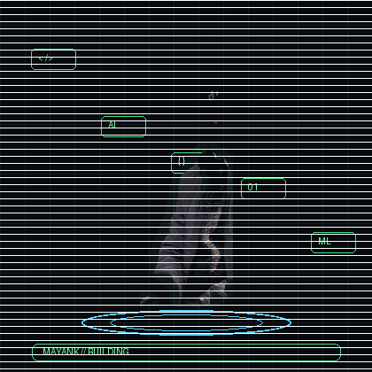

### `BUILD • LEARN • SHIP • REPEAT`

**I turn ideas into practical web, mobile & AI-powered products.**

  
  
  
  

<a href="https://www.linkedin.com/in/mayank-joshi-90627836a/">LinkedIn</a> ·
<a href="mailto:mayankjoshi640@gmail.com">Email</a> ·
<a href="https://www.youtube.com/@mayank13joshi">YouTube</a> ·
<a href="https://github.com/13mayankjoshi13">GitHub</a>

---

## ✦ About Me

I'm a **B.Tech CSE (AI & ML)** student who enjoys building things that move from **idea → prototype → usable product**.

- 🎓 **4th Semester** — B.Tech CSE (AI & ML)
- 🧩 Interested in **AI/ML, full-stack development, mobile apps & automation**
- 🚀 Currently building and improving real-world software products
- 🧠 Learning through projects, DSA, experiments and hackathons
- ⚡ Motto: **Curiosity starts the build. Engineering finishes it.**

---

## 🧭 What I'm Working On

<table>
<tr>
<td width="50%" valign="top">

### 🛍️ Ruhanix Solutions
**SDE Intern · Jun 2026**

Working on a wholesale marketplace connecting **traders, products, pricing, orders and customers**.

`React Native` `Expo` `Node.js`  
`PHP` `MySQL` `XAMPP`

</td>
<td width="50%" valign="top">

### ✨ Google
**Gemini Student Ambassador · Aug 2025**

Exploring and promoting the **Gemini ecosystem** while growing through the developer community.

`AI` `Community` `Developer`

</td>
</tr>
<tr>
<td width="50%" valign="top">

### 💻 Infosys Springboard
**Intern · Nov 2025 – Jan 2026**

Industry internship experience focused on software and technology.

</td>
<td width="50%" valign="top">

### 🌱 Earlier
**Internships / Partnerships**

`Internshala` · `YBI Foundation`

</td>
</tr>
</table>

---

## 🏆 Highlights

---

## 🧰 Tech Stack

### Languages

### Web · Backend · Mobile

### AI / ML

 

### Database · Tools

> **DSA:** Striver's A2Z Sheet

---

## 🚀 Featured Projects

<table>
<tr>
<td width="50%" valign="top">

### 🛒 Ruhanix Marketplace
Wholesale marketplace for **Android, iOS & Web**, built around traders, buyers, products, pricing and orders.

`React Native` · `Expo` · `Node.js` · `PHP` · `MySQL`

</td>
<td width="50%" valign="top">

### 🏏 IPL 2024 Analytics
Data analytics + ML/DL project exploring **IPL 2024 player performance**.

<a href="https://github.com/13mayankjoshi13/IPL-2024-Data-Analytics-ML-DL-Model">View repository →</a>

</td>
</tr>
<tr>
<td width="50%" valign="top">

### 💳 UPI Fraud Detection
Machine-learning model for classifying **fraudulent UPI transactions**.

<a href="https://github.com/13mayankjoshi13/UPI_FRAUD_DETECTION">View repository →</a>

</td>
<td width="50%" valign="top">

### 🧠 ET Context Lens
A **multi-agent AI system** designed for contextual analysis.

<a href="https://github.com/13mayankjoshi13/ET-Context-Lens--Multiagent-system">View repository →</a>

</td>
</tr>
<tr>
<td width="50%" valign="top">

### 🧤 Assistive Glove Device
Hardware-based assistive technology project.

<a href="https://github.com/13mayankjoshi13/Assistive_Glove_Device">View repository →</a>

</td>
<td width="50%" valign="top">

### 🎮 Gesture Game
Hand-gesture controlled fighting game with a Flask web deployment.

<a href="https://github.com/13mayankjoshi13/advanced_gesture_fighting_game">Fighting Game →</a> ·
<a href="https://github.com/13mayankjoshi13/gesture_game_web">Web Version →</a>

</td>
</tr>
</table>

---

## 📜 Certifications

| Platform | Certification |
|:--|:--|
| 🟣 **Kaggle** | 5-Day AI Agents Intensive Course with Google |
| 🔵 **Microsoft** | AI Skill Fest |
| 🔵 **Microsoft** | Azure AI Fundamentals |
| 🔷 **Cisco** | Introduction to Modern AI |
| 🔷 **Cisco** | Python Essentials |

---

## 📈 GitHub

 

---

## 🧪 Build Philosophy

**IDEA** → **RESEARCH** → **BUILD** → **DEBUG** → **SHIP** → **REPEAT**

 

> *“Don't wait for the perfect idea. Build the version that makes the next version possible.”*

---

## 🌐 Let's Connect

  

  

### `KEEP BUILDING. KEEP SHIPPING. ✦`

